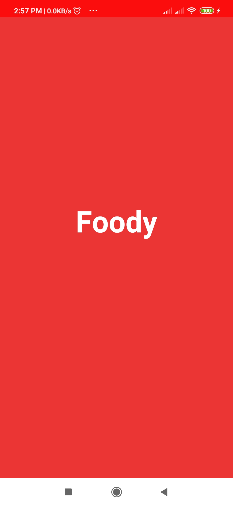

# Foody
This is food ordering app that has been made by me. I have used the following things.
1. Volley for making the API request.
2. Nested Recycler View.
3. Picasso library.
4. Room database for storing entity.

This app features the following screen.

1. Welcome screen
2. Login Screen
3. Registration Activity.
4. Forget Password Activity.
5. OTP Activity.

Screenshot of my App.

